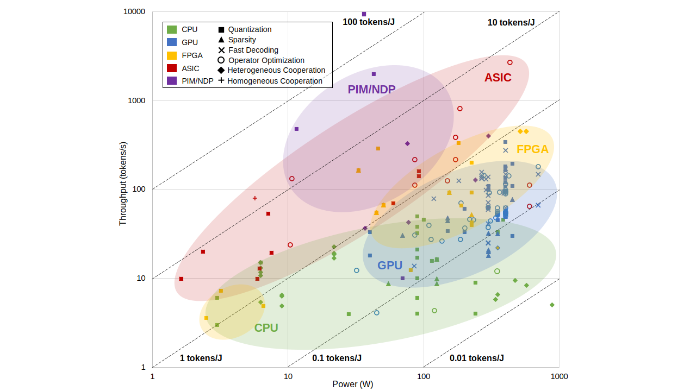

# 🔍 LLM Hardware Survey

## 📘 Large Language Model Inference Acceleration: A Comprehensive Hardware Perspective

[📄 **Paper Link**](https://arxiv.org/pdf/2410.04466)  
[🌐 **Project Website**](https://dai.sjtu.edu.cn/project.html)  
[🏛️ **Lab Homepage (DAI Lab @ SJTU)**](https://dai.sjtu.edu.cn/)

---

## 🧠 Overview

Large Language Models (LLMs) have demonstrated remarkable capabilities across various domains, from natural language understanding to text generation. Among them, **generative LLMs** (e.g., GPT, LLaMA) are the main focus today due to their superior algorithmic performance compared to non-generative models like BERT or DeBERTa.

The rapid advancements in generative LLMs are deeply intertwined with the evolution of hardware systems. Different hardware platforms — such as **CPU**, **GPU**, **FPGA**, **ASIC**, and **PIM/NDP** — offer distinct architectural features that can significantly enhance inference performance.

The figure below illustrates the throughput (with batch size 1) and power consumption of the decode stage for an LLM (~7B) across different platforms with different optimization methods.


Accuracy Loss vs Throughput vs Power Consumption


---

## 🧩 What’s in the Paper?

This paper presents a **comprehensive survey** of generative LLM inference across diverse hardware platforms, focusing on both software and hardware co-optimization:

- 📐 **Architecture Overview**: An in-depth look at the algorithmic architecture of mainstream generative LLMs and their inference processes.
- 🛠️ **Optimization Techniques**: Detailed summaries of platform-specific optimization methods for CPUs, GPUs, FPGAs, ASICs, and processing-in-memory (PIM) systems.
- ⚙️ **Performance Analysis**:
  - **Batch sizes** 1 and 8
  - **Metrics**: Tokens per second (throughput), tokens per joule (energy efficiency), and power consumption
  - **Cross-platform comparisons** and same-platform method comparisons

---

## 🔍 Key Findings

- Hardware-specific optimizations are crucial for improving LLM inference.
- Energy efficiency is becoming a key performance metric, especially in **edge AI** scenarios.
- Emerging trends such as **multimodal models**, **compute-efficient inference**, and **hardware-software co-design** will redefine the future of LLM deployment, particularly at the edge.

---

## 🚀 Project

This project provides the benchmarking framework, datasets, and results used in our study.  
👉 Visit the [project homepage](https://dai.sjtu.edu.cn/project.html) for more details.

---

## 📩 Citation

If you find our work useful, please consider citing our paper:
```
@article{li2024large,
  title={Large language model inference acceleration: A comprehensive hardware perspective},
  author={Li, Jinhao and Xu, Jiaming and Huang, Shan and Chen, Yonghua and Li, Wen and Liu, Jun and Lian, Yaoxiu and Pan, Jiayi and Ding, Li and Zhou, Hao and others},
  journal={arXiv preprint arXiv:2410.04466},
  year={2024}
}
```
